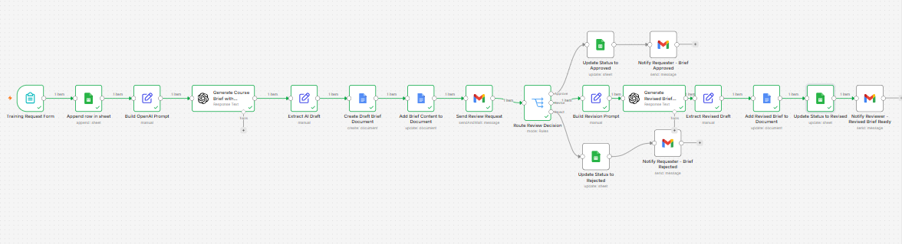
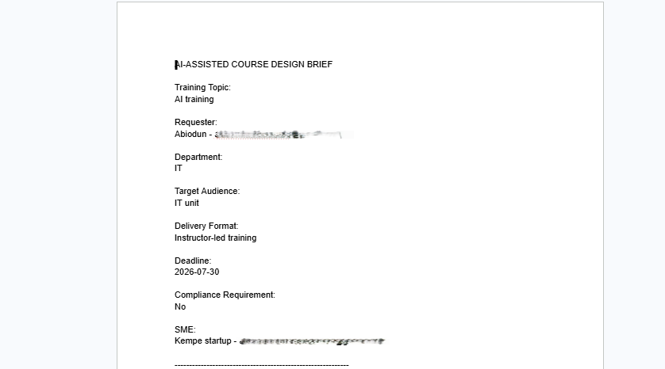
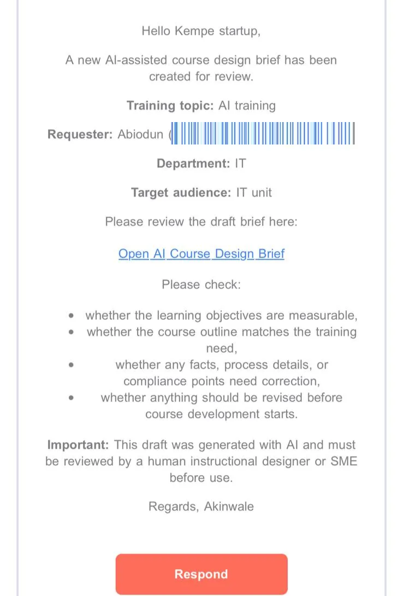
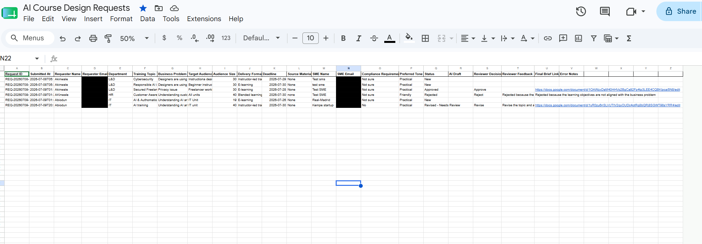

# AI-Assisted Course Design Workflow

An automated pipeline that turns raw training requests into structured, 
review-ready course design briefs — with a mandatory human review gate 
before anything moves to development.

## Problem

Training requests were coming in faster than they could be turned into 
structured briefs, each needing a training-needs summary, learning 
objectives, and outline before design work could start. Writing every 
first draft from scratch was the bottleneck.

## How it works

1. **Intake** — a training request is submitted and logged to Google Sheets
2. **AI draft** — the OpenAI API generates a structured first-draft brief, 
   saved to Google Docs
3. **Human review** — the reviewer gets an emailed link and responds 
   Approve, Revise, or Reject
4. **Routing** — each decision routes the workflow down a different path, 
   and the outcome is logged back to the tracking sheet

### AI-generated brief

### Reviewer notification

### Status tracking

## Why the human review gate

The goal isn't to remove instructional design judgment from the process 
it's to remove the blank page, so that judgment gets spent on the 
decisions that actually need it. One request came in scoped only to an 
IT department; on review, the audience was corrected to include all 
staff, and the workflow logged both the original and revised versions. 
That's the kind of call automation alone can't make.

## Tech stack

n8n · OpenAI API · Google Sheets · Google Docs · Gmail

## Contents

- `n8n-workflow.json` — exported workflow (credentials stripped)
- `workflow-canvas.png`, `ai-brief.png`, `reviewer-email.png`, 
  `status-tracker.png` — screenshots of each stage

## Full case study

For the complete write-up with the full judgment-call example: 
**[View the case study →](https://app.notion.com/p/AI-Assisted-Course-Design-Workflow-37c26a77f8e68067b23ddbe961b92f2a?source=copy_link)**
